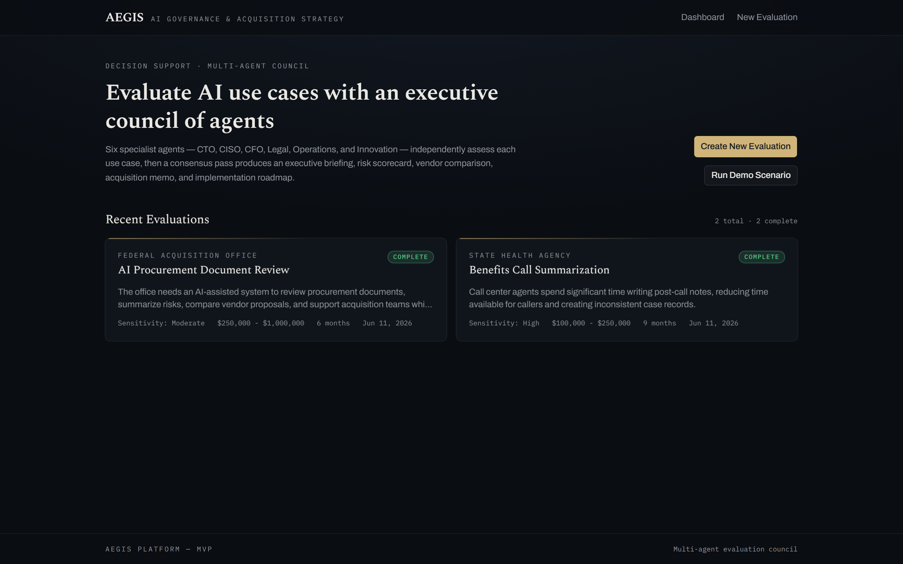
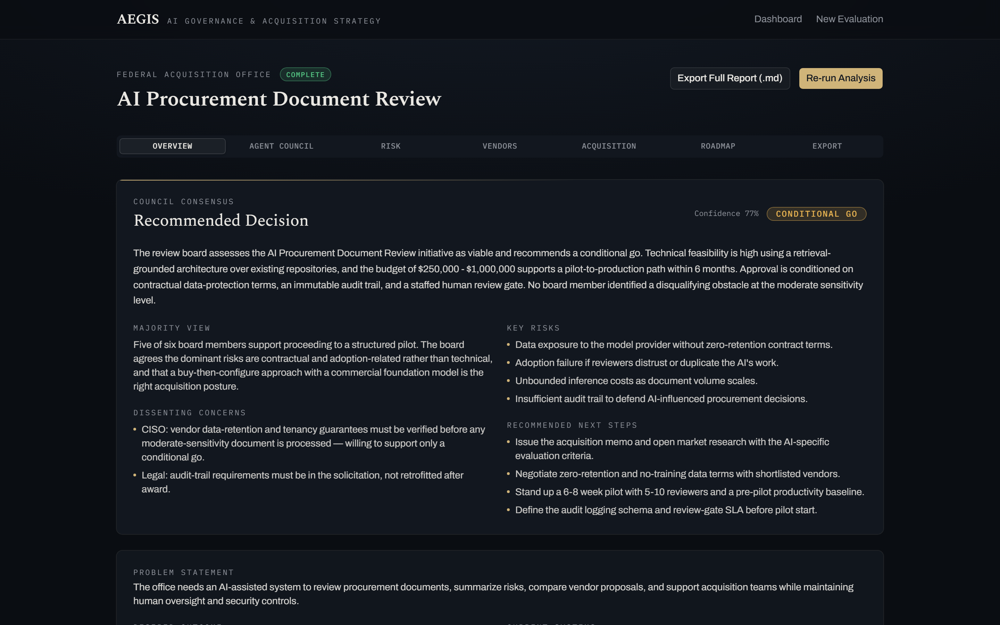
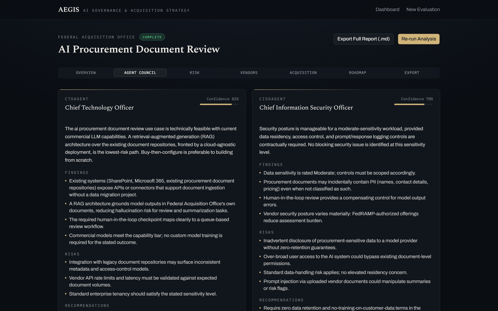
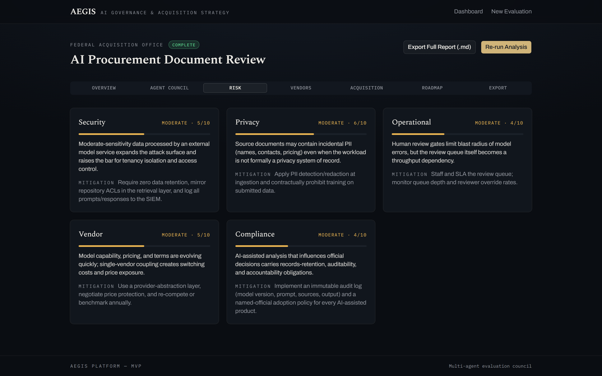
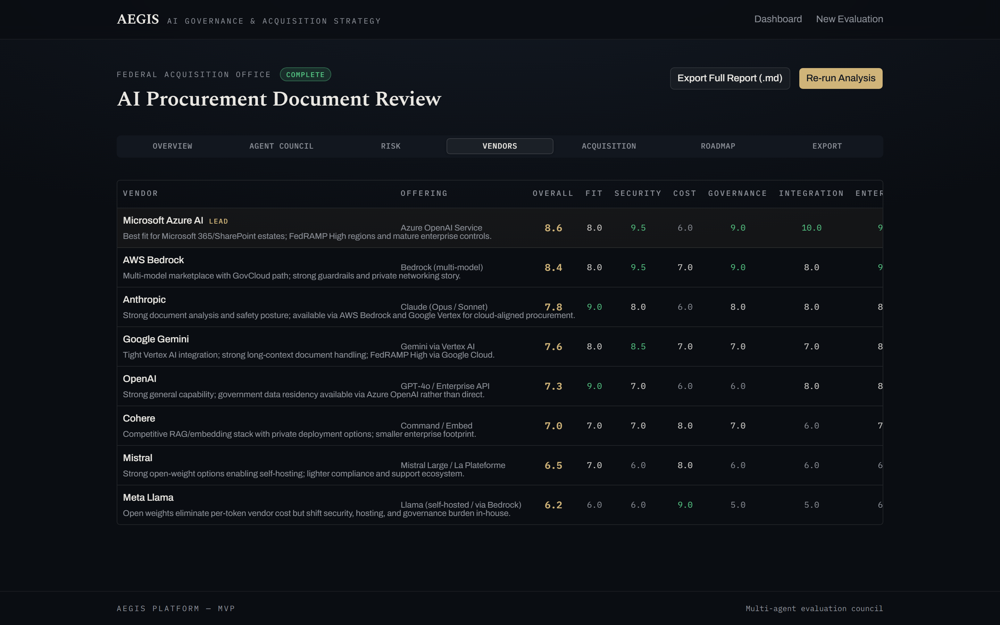
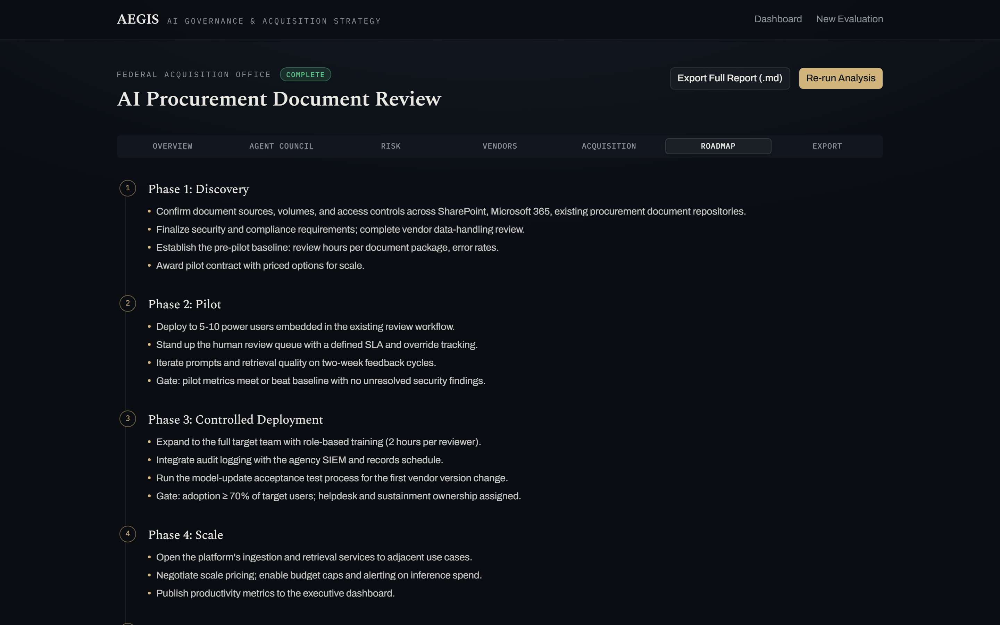
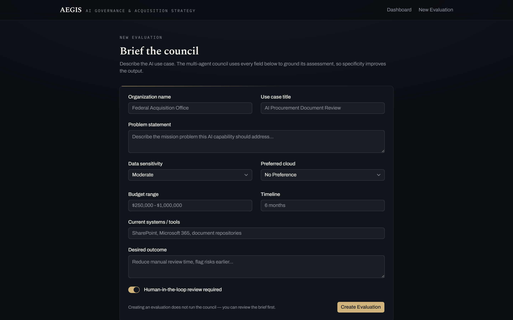

# AEGIS — AI Governance & Acquisition Strategy Platform

AEGIS is a multi-agent AI strategy platform that evaluates proposed AI use
cases the way an executive review board would. Six specialist agents — CTO,
CISO, CFO, Legal/Compliance, Operations, and Innovation — independently assess
each use case, a consensus pass weighs their findings against each other, and
the platform produces acquisition-ready outputs: an executive briefing, risk
scorecard, vendor comparison, acquisition memo, and implementation roadmap.

Built as a working MVP: the demo scenario runs end-to-end with **zero
configuration** (no API keys required) using a deterministic analysis engine,
and switches to live LLM analysis when an Anthropic or OpenAI-compatible key
is provided.

## Screenshots

**Dashboard**



**Consensus decision (Overview tab)**



**Agent Council — six independent assessments**



**Risk Scorecard**



**Vendor Comparison**



**Implementation Roadmap**



**New Evaluation form**



To regenerate: `npm run start`, click **Run Demo Scenario** (or `POST /api/demo`),
then `node scripts/screenshots.mjs`.

## Demo Scenario

One click on **Run Demo Scenario** creates and analyzes:

> **Federal Acquisition Office — AI Procurement Document Review.** An
> AI-assisted system to review procurement documents, summarize risks, compare
> vendor proposals, and support acquisition teams while maintaining human
> oversight and security controls. Moderate sensitivity, $250K–$1M, 6 months,
> human-in-the-loop required.

The council returns a **Conditional Go** with dissenting concerns from the
CISO and Legal seats, an 8-vendor comparison, a 5-category risk scorecard, and
all four generated documents, exportable as a single markdown report.

## Tech Stack

| Layer | Choice |
| --- | --- |
| Frontend | Next.js 16 (App Router), TypeScript, Tailwind CSS v4, shadcn/ui |
| Backend | Next.js API routes |
| Agents | Prompt-defined agents with a provider-agnostic orchestration layer |
| LLM providers | Anthropic SDK, OpenAI-compatible REST, deterministic mock engine |
| Database | SQLite via better-sqlite3 |
| Reports | Markdown generation, browser download export |

## Architecture

```
┌────────────────────────────────────────────────────────────┐
│  Next.js App                                               │
│                                                            │
│  Dashboard ── New Evaluation ── Evaluation Detail (tabs)   │
│       │              │                  │                  │
│       └──────────────┴───────┬──────────┘                  │
│                              ▼                             │
│  API routes  /api/evaluations  /:id  /:id/run  /:id/export │
│                              │                             │
│                              ▼                             │
│  Agent orchestrator (src/agents)                           │
│   ├─ 6 specialist agents (parallel)  ─┐                    │
│   ├─ consensus agent (debate pass)    │  LLM provider      │
│   │                                   ├─ anthropic         │
│   ├─ vendor scoring (deterministic)   ├─ openai-compatible │
│   ├─ risk scorecard (deterministic)   └─ mock (no key)     │
│   └─ document generation (markdown)                        │
│                              │                             │
│                              ▼                             │
│  SQLite (evaluations, agent_outputs, artifacts)            │
└────────────────────────────────────────────────────────────┘
```

Design notes:

- **Vendor scores and the risk scorecard are rule-based**, not LLM-generated,
  so they are consistent and explainable across runs. The six agent
  assessments and the consensus pass are LLM-generated when a key is present.
- **The mock engine is evaluation-aware**: outputs are derived from the
  submitted fields (sensitivity, budget, cloud, human-in-the-loop), so
  different inputs produce different findings and decisions — e.g. High
  sensitivity without human review yields a No-Go.

## Agents

| Agent | Role | Focus |
| --- | --- | --- |
| `ctoAgent` | Chief Technology Officer | Feasibility, architecture, build vs buy |
| `cisoAgent` | Chief Information Security Officer | Security, data governance, PII, mitigations |
| `cfoAgent` | Chief Financial Officer | Cost drivers, ROI, total cost of ownership |
| `legalComplianceAgent` | Legal & Compliance Counsel | Compliance, procurement, auditability |
| `operationsAgent` | Chief Operations Officer | Rollout, staffing, training, adoption |
| `innovationAgent` | Chief Innovation Officer | Strategic opportunity, scaling potential |
| `consensusAgent` | Board Facilitator | Debate pass, majority view, go/no-go decision |

## Setup

```bash
npm install
npm run dev        # http://localhost:3000
```

That's it — with no environment variables the platform runs on the
deterministic mock engine and the demo works end-to-end.

To use a live LLM, copy `.env.example` to `.env.local` and set a key:

```bash
LLM_PROVIDER=anthropic
ANTHROPIC_API_KEY=sk-ant-...
```

## Environment Variables

| Variable | Default | Purpose |
| --- | --- | --- |
| `LLM_PROVIDER` | auto | `anthropic`, `openai`, or `mock`. Auto-detects from available keys; falls back to `mock`. |
| `ANTHROPIC_API_KEY` | — | Enables the Anthropic provider |
| `ANTHROPIC_MODEL` | `claude-opus-4-8` | Anthropic model ID |
| `OPENAI_API_KEY` | — | Enables the OpenAI-compatible provider |
| `OPENAI_BASE_URL` | `https://api.openai.com/v1` | Any OpenAI-compatible endpoint |
| `OPENAI_MODEL` | `gpt-4o-mini` | Model for the OpenAI-compatible provider |
| `DATABASE_URL` | `file:./aegis.db` | SQLite database path |

## API

| Route | Method | Purpose |
| --- | --- | --- |
| `/api/evaluations` | POST / GET | Create / list evaluations |
| `/api/evaluations/:id` | GET | Evaluation with all outputs |
| `/api/evaluations/:id/run` | POST | Run the full agent pipeline |
| `/api/evaluations/:id/export/markdown` | GET | Download the full report |
| `/api/demo` | POST | Create and run the demo scenario |

## Roadmap

- [ ] Live progress streaming while agents run (SSE per-agent status)
- [ ] PDF export alongside markdown
- [ ] LLM-assisted vendor scoring blended with the rule-based baseline
- [ ] Evaluation versioning and side-by-side comparison
- [ ] Supabase/PostgreSQL option for multi-user deployments
- [ ] Authentication and role-based access
